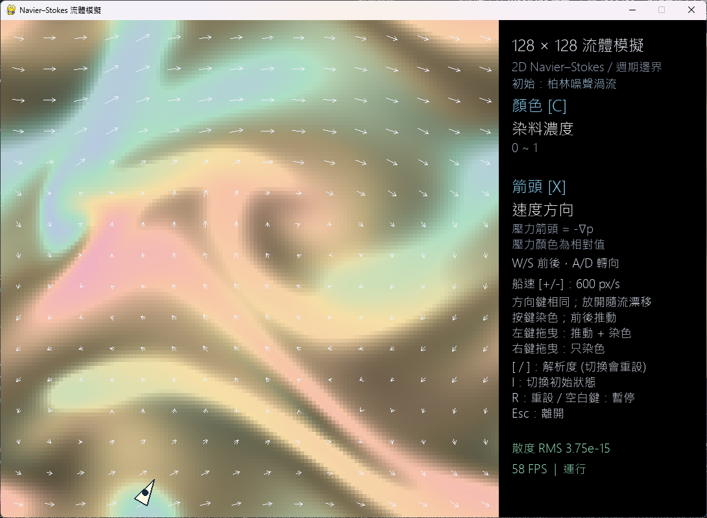

# Navier–Stokes 互動式流體模擬

這是一個以 Python、NumPy 與 Pygame 製作的二維不可壓縮流體視覺化程式。程式在固定大小的視窗中顯示速度場、相對壓力、渦度或染料，並可用滑鼠推動流場、注入染料。模擬網格解析度可以在執行時切換，視窗本身不會跟著放大或縮小。

程式入口是 `main.py`。目前沒有另外提供 `requirements.txt`；執行環境只需要 NumPy 與 Pygame 相容套件。

## 功能一覽

- 使用固定時間步近似求解二維不可壓縮 Navier–Stokes 方程。
- 提供兩種可切換的初始流場：泰勒–格林渦流加微小擾動，以及柏林噪聲渦流。
- 可在 32、64、128、192 的方形網格間切換；模擬畫面固定為 768×768 像素。
- 可按 `H` 將模擬顏色平滑插值到 768×768 畫面，不增加物理網格的解析度。
- 以顏色顯示速度大小、相對壓力、渦度或染料濃度。
- 以箭頭疊加顯示速度方向、壓力力方向或染料濃度梯度。
- 左鍵拖曳同時施加動量與染料；右鍵點擊或拖曳只加入染料。
- 小船會被當地流場帶著漂移；W／上與 S／下相對船頭前進或倒退，A／左與 D／右改變船頭方向。按鍵時會染色，前進或倒退也會推動流體。
- 筆刷色相隨時間循環，染料會隨流場搬運並逐漸淡出。
- 右側面板顯示網格、初始狀態、目前顯示模式、散度 RMS、FPS 與暫停狀態。

## 視窗與操作

視窗固定為 **1088×768 像素**：左側 768×768 是流體畫面，右側 320 像素是資訊與操作提示面板。模擬解析度是內部網格大小，不是視窗大小；低解析度會放大顯示，高解析度則會縮小映射到同一畫面區域。

預設以一般方式放大顏色畫面；按 `H` 可切換為色彩插值顯示，讓網格間的顏色過渡更平滑。這只改變顯示結果，不改變流體計算，也不會重設模擬。



| 操作 | 功能 |
| --- | --- |
| `[` | 降低一級模擬解析度：192 → 128 → 64 → 32 |
| `]` | 提高一級模擬解析度：32 → 64 → 128 → 192 |
| `H` | 切換一般放大與 768×768 色彩插值顯示 |
| `C` | 循環切換速度大小、相對壓力、渦度、染料濃度顏色模式 |
| `X` | 循環切換速度箭頭、壓力力箭頭、染料梯度箭頭、關閉箭頭 |
| `I` | 切換初始流場並重設模擬 |
| `R` | 重設目前的初始流場、染料與小船位置 |
| 不按 WASD 或方向鍵 | 小船跟著當地流體漂移，船頭朝向保持不變，不主動注入染料 |
| `W`／`↑` | 沿船頭方向前進，同時推動流體並注入染料 |
| `S`／`↓` | 沿船尾方向倒退，同時推動流體並注入染料 |
| `A`／`←` | 向左轉船頭，按住時注入染料 |
| `D`／`→` | 向右轉船頭，按住時注入染料 |
| `+`／`=`／數字鍵盤 `+` | 提高一級小船速度 |
| `-`／數字鍵盤 `-` | 降低一級小船速度 |
| 滑鼠左鍵點擊 | 注入染料 |
| 滑鼠左鍵拖曳 | 注入染料並沿拖曳方向施加動量 |
| 滑鼠右鍵點擊／拖曳 | 只注入染料，不施加動量 |
| `Space` | 暫停／繼續流體計算 |
| `Esc` | 關閉程式 |

切換解析度會重建流場、重設染料，並讓小船回到起點，不會保留切換前的模擬狀態。模擬畫面使用週期邊界，因此染料、流體與小船從畫面一側離開後會從對側出現。

### 小船與速度

小船從畫面中央偏左的位置出發，船身約 40×22 像素，初始船頭朝上。程式會在小船位置取樣流體速度，讓它即使沒有按鍵也會隨流漂移。水流可以把小船側向帶走，但不會改變船頭朝向。起點刻意避開泰勒–格林流場中心的停滯位置，方便直接看到漂流效果。

`W`／`↑` 沿船頭前進，`S`／`↓` 沿船尾倒退；`A`／`←` 與 `D`／`→` 讓船頭以每秒 180 度的預設速度左轉或右轉。可以一邊轉向一邊前進，形成彎曲航跡。前進或倒退的駕駛速度會疊加在當地流速上，推動流體並注入染料；只按轉向鍵時會原地轉向並注入染料，但不會主動向前推動流體。單純被水流帶動時不會自動染色。高速航跡會分段注入，以減少斷裂。

預設前進／倒退速度是 **120 畫面像素／秒**；每按一次 `+` 或 `-` 就切換一級。八級速度依序是 120、180、270、400、600、900、1350、2000 畫面像素／秒。2000 畫面像素／秒的駕駛速度約 0.38 秒即可走過 768 像素；實際移動還會疊加當地流速。右側面板顯示的是前進／倒退速度。暫停時小船停止移動；調整速度本身不會讓小船前進。

## 初始流場

### 泰勒–格林渦流 + 微擾

第一種狀態使用平滑且規則的渦流作為底場，再疊加小幅度、週期式的柏林噪聲速度擾動。底場形式為：

```text
u = U sin(2πx / L) cos(2πy / L)
v = -U cos(2πx / L) sin(2πy / L)
```

其中 `U` 由 `INITIAL_FLOW_SPEED` 控制，`L` 對應週期網格的長度。噪聲擾動強度由 `INITIAL_PERTURBATION` 控制，預設是底場速度的 2%。這個初始狀態適合觀察規則大渦流如何被微擾打破。

### 柏林噪聲渦流

第二種狀態把多層、週期式柏林梯度噪聲組合成流函數 `ψ`，再取其旋度生成速度：

```text
u = ∂ψ / ∂y
v = -∂ψ / ∂x
```

以流函數旋度建立速度，可讓初始速度場接近無散度。不同 octave 使用不同噪聲尺度與權重，讓流場同時具有較大的渦旋結構與較細的變化。程式目前以 Python 的 `hash()` 計算噪聲種子，因此同一次啟動期間重設會得到相同圖樣；不同次啟動的圖樣可能不同。由於 `hash()` 可能回傳負數，送入 NumPy 亂數產生器前會先取模轉為非負整數。柏林噪聲的基本概念可參考 [Ken Perlin 的 Noise 頁面](https://mrl.cs.nyu.edu/~perlin/noise/)；本程式自行實作週期式二維梯度噪聲。

## 模擬計算概念

程式處理的是二維、不可壓縮、近似常密度流體。方程可概略寫成：

```text
∂u/∂t + (u · ∇)u = -∇p + ν∇²u + f
∇ · u = 0
```

`u` 是速度場，`p` 是壓力，`ν` 是黏性，`f` 是外力；滑鼠左鍵拖曳或駕駛小船會向局部速度場加入動量。每個固定物理時間步大致依序執行：

1. **平流（advection）**：根據目前速度，反向追蹤每個網格點上一時間步的位置，再用雙線性插值取回速度。這是半拉格朗日近似，通常較穩定，但會讓很細的小結構逐漸變平滑。
2. **黏性擴散（diffusion）**：將速度轉到傅立葉空間，依波數大小乘上指數衰減，讓高頻、小尺度的速度變化消散得更快。
3. **壓力投影（pressure projection）**：在傅立葉空間計算散度與壓力，再扣除壓力梯度，使速度場回到接近無散度的狀態。此步驟是維持不可壓縮條件的核心。
4. **染料搬運與淡出**：用更新後的速度平流染料及染料色相，再依 `DYE_FADE_RATE` 緩慢衰減。染料是被動標記，不會改變流體速度或壓力。

散度 RMS 是速度場偏離「無散度」程度的數值診斷；它以 `DIVERGENCE_FPS` 指定的頻率重新計算，預設每秒 6 次。它的更新率低於畫面更新率，不代表整個模擬只以 6 FPS 運行。視窗渲染上限為 60 FPS，物理計算使用 `SIM_DT` 固定步長，程式會依實際經過時間補做時間步。

## 顏色與箭頭

按 `C` 切換顏色模式：

- **速度大小**：顏色代表每格速度向量的大小。
- **相對壓力**：以色彩兩側表示相對高壓與低壓；壓力只差一個任意常數，因此不代表絕對壓力。
- **渦度**：顯示二維速度場的旋轉強度與方向，計算量為 `∂v/∂x - ∂u/∂y`。
- **染料濃度**：顯示筆刷注入的顏色與濃度。筆刷色相會隨時間循環，混合後的色彩會隨染料一起移動。

速度、壓力與渦度顏色會依當前畫面資料的第 98 百分位數調整顯示範圍，避免少數極端值讓大部分畫面失去層次；因此相同顏色在不同影格不一定代表完全相同數值。染料顏色則以 0～1 的濃度映射，濃度低時會呈現較暗的畫面。

按 `X` 切換箭頭模式。箭頭顏色為亮色，以便疊在流場上辨認：

- **速度方向**：箭頭指向局部流動方向。
- **壓力力方向**：箭頭代表 `-∇p`，是壓力作用於流體的方向，不是壓力本身的大小圖。
- **染料梯度**：箭頭指向染料濃度增加較快的方向。
- **關閉**：只顯示底下的顏色場。

箭頭會稀疏取樣以避免遮住底圖；箭頭長度依目前取樣向量大小調整，顯示用途為定性觀察。

## 可調參數

所有主要設定集中在 `main.py` 頂部的「可調參數」區。修改後重新啟動程式即可套用。

| 參數 | 預設值 | 說明 |
| --- | ---: | --- |
| `RESOLUTIONS` | `(32, 64, 128, 192)` | `[`、`]` 可切換的內部方形網格解析度。 |
| `DEFAULT_RESOLUTION` | `128` | 程式啟動時使用的網格解析度；不改變視窗大小。 |
| `DEFAULT_INITIAL_STATE` | `0` | 啟動初始狀態；`0` 為泰勒–格林 + 微擾，`1` 為柏林噪聲渦流。 |
| `VIEW_PIXELS` | `768` | 左側流體畫面寬與高，單位為螢幕像素。 |
| `PANEL_PIXELS` | `320` | 右側資訊面板寬度，視窗總寬為兩者相加。 |
| `SIM_DT` | `1 / 60` 秒 | 固定物理時間步；較小通常更穩定，但每秒計算次數也會增加。 |
| `INITIAL_FLOW_SPEED` | `44.0` | 初始流場速度尺度。 |
| `INITIAL_PERTURBATION` | `0.02` | 第一種初始狀態加入的相對微擾比例。 |
| `PERLIN_CELLS` | `4` | 柏林噪聲基礎 octave 的格點數；值大會產生較細的空間變化。 |
| `PERLIN_OCTAVES` | `3` | 疊加的噪聲層數；層數越多會增加細節。 |
| `PERLIN_SEED` | `hash("Navier-Stokes interactive fluid simulator")` | 柏林噪聲種子；同一次啟動期間維持固定，使用前轉為非負整數。 |
| `VISCOSITY` | `0.4` | 黏性係數；提高後速度細節消散更快。程式會依解析度平方縮放。 |
| `MOUSE_FORCE` | `3.0` | 左鍵拖曳注入動量的強度。 |
| `MAX_SPEED` | `70.0` | 滑鼠施力後每個速度分量的上限（會依解析度縮放）。 |
| `BRUSH_RADIUS` | `2.5` | 染料與滑鼠施力的筆刷半徑，以預設網格格數為基準縮放。 |
| `DYE_STRENGTH` | `0.50` | 每次筆刷注入染料的量。 |
| `DYE_FADE_RATE` | `0.06` | 染料淡出速率；不是流體黏性。設為 0 可停止淡出。 |
| `DYE_COLOR_PERIOD` | `4.0` 秒 | 筆刷色相循環的時間週期。 |
| `DIVERGENCE_FPS` | `6.0` | 散度 RMS 診斷值每秒更新次數；不控制流體計算或畫面 FPS。 |
| `BOAT_SPEEDS` | `120.0`～`2000.0`，共八級 | 前進／倒退時的額外駕駛速度，單位為畫面像素／秒；第一個值是啟動速度。 |
| `BOAT_TURN_SPEED` | `π` 弧度／秒 | 按住左／右轉向鍵時的轉速；預設為每秒 180 度。 |
| `BOAT_START` | `(畫面寬度 × 0.35, 畫面高度 × 0.5)` | 小船啟動與重設時的位置，避開預設流場中心的停滯點。 |

一般而言，先調 `INITIAL_FLOW_SPEED` 觀察初始流動快慢；再調 `VISCOSITY` 觀察渦流維持時間；要改變滑鼠與小船的推動／染色效果，調整 `MOUSE_FORCE`、`BRUSH_RADIUS` 與 `DYE_STRENGTH`。小船的前後速度範圍與轉向速度分別由 `BOAT_SPEEDS`、`BOAT_TURN_SPEED` 修改。若只是想改變流場圖樣，調整 `PERLIN_CELLS`、`PERLIN_OCTAVES` 或 `PERLIN_SEED`，或直接按 `I` 切換另一種初始狀態。

## 模型限制與解讀注意

- **週期邊界**：畫面不是有牆壁的容器；流體、染料與小船會從一側繞回另一側。
- **二維近似**：程式沒有模擬三維深度方向的流動。
- **簡化物理模型**：沒有自由液面、表面張力、浮力或獨立可調密度；不能視為精密工程或實驗用 CFD 求解器。
- **相對壓力**：不可壓縮投影求出的壓力以任意常數為基準，畫面適合比較相對高低，不是絕對壓力讀值。
- **非 SI 單位**：速度、長度與時間用於視覺化網格，並未校準成公尺、秒或帕斯卡。
- **染料是被動示蹤物**：染料只用來看流線，不會影響速度場。
- **小船是簡化示蹤物**：小船直接取用所在位置的流速，沒有另外計算船重、慣性或船體與流體間的阻力。
- **解析度與效能**：192×192 網格比 128×128 有更多計算量；若 FPS 不足，可按 `[` 降低解析度。畫面 FPS 仍受電腦與繪圖環境影響。
- **數值耗散**：半拉格朗日平流與染料淡出會讓細節逐漸平滑或變淡；這是目前簡化模型的行為之一。

## 參考資料

- [pygame-ce 安裝指南](https://github.com/pygame-community/pygame-ce/wiki/Installing-pygame%E2%80%90ce)
- [pygame-ce 專案](https://github.com/pygame-community/pygame-ce)
- [Ken Perlin：Noise](https://mrl.cs.nyu.edu/~perlin/noise/)
